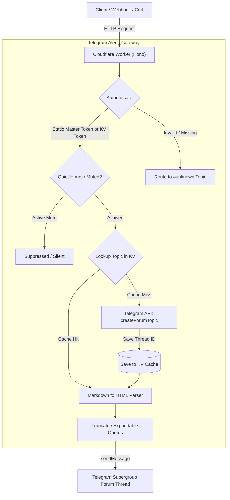

# Architecture

**Telegram Alerts Gateway** is designed to be lightweight, zero-maintenance, and cost-free on Cloudflare Workers' free tier (100,000 requests/day).

---

## High-Level Workflow

Here is how an incoming notification moves through the gateway:

---

## Core Components

### 1. Cloudflare Workers & Hono
- Written in TypeScript using [Hono](https://hono.dev/), a fast and lightweight web framework for the edge.
- Runs globally on Cloudflare edge servers with sub-millisecond cold starts and no persistent VM overhead.

### 2. Cloudflare KV Topic Caching
- When an alert arrives for `topic: "database"`, the worker queries KV for `topic:database`.
- If cached, the worker directly posts to `message_thread_id`.
- If not cached (or if Telegram reports that the topic was deleted), the worker calls Telegram's `createForumTopic` API, saves the newly created thread ID to KV, and delivers the message.

### 3. Smart Formatting & HTML Parser
- Converts Markdown syntax (headers, bold, italic, inline code, fenced code blocks) into Telegram-supported HTML.
- Long stack traces or error logs are automatically enclosed in collapsible `<blockquote expandable>` tags so they don't flood chat screens.
- Safely balances open HTML tags during truncation to prevent Telegram API formatting rejections.

### 4. Dynamic Token Subsystem
- In addition to the master `AUTH_TOKEN`, team members can generate scoped, named, or expiring tokens inside Telegram using `/token`.
- Tokens are stored in Cloudflare KV with TTL metadata.
